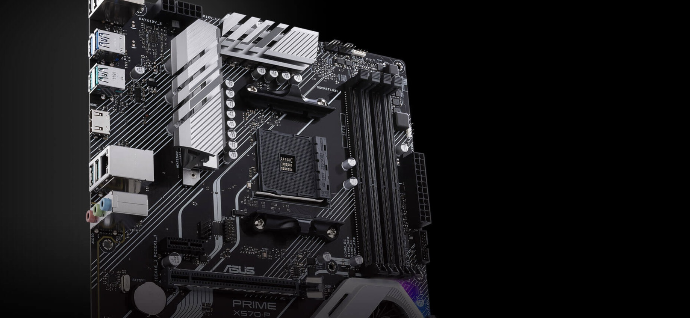

# EFI_X570-P
**Ryzentosh EFI for the Asus X570-P motherboard**

## Hardware List

**Specific model:** [Asus X570-P Motherboard](https://www.asus.com/motherboards-components/motherboards/prime/prime-x570-p/)

|  Hardware   |                       Information                       | status |
| :---------: | :-----------------------------------------------------: | :----: |
|    `CPU`    |     AMD Ryzen Threadripper 5900X 12-Core Processor      |   ✅    |
|    `GPU`    |           AMD Radeon RX 5500XT 8GB (Navi 14)            |   ✅    |
|    `USB`    |             Internal / External Usb mapping             |   ✅    |
|   `Disk`    |                Samsung SSD 970 EVO Plus                 |   ✅    |
|   `WIFI`    |         Intel® Corporation Wi-Fi 6 AX210 160MHz         |   ✅    |
|  `Audio#0`  |                    Realtek ALCS1200A                    |   ✅    |
|  `Audio#1`  |            AMD Radeon RX Navi 10 HDMI Audio             |   ✅    |
| `Bluetooth` |               Intel® Wireless Bluetooth®                |   ✅    |
| `Ethernet`  | Realtek RTL8168 PCI Express Gigabit Ethernet Controller |   ✅    |

## BIOS Setting
May not all options are present in your firmware. Do not be too concerned if many of these options are not available in your BIOS.
### Disable
- Fast Boot
- Secure Boot
- Serial/COM Port
- Parallel Port
- CSM (Compatibility Support Module)
- IOMMU
> For 3990X users: macOS currently does not support more than 64 threads in the kernel, and so will kernel panic if it sees more. The 3990X CPU has 128 threads total and so requires half of that disabled. We recommend disabling hyper threading in the BIOS for these situations.
### Enable
- Above 4G Decoding
> For Gigabyte/Aorus or an AsRock motherboard, if it breaks certain drivers (Ethernet) or boot failures on other OSes, if it does happen then disable this option and opt for npci instead.

> For 2020+ BIOS, If the Resizable BAR support is in your BIOS, it could be enabled when enabling Above 4G. Please ensure that `Booter` -> `Quirks` -> `ResizeAppleGpuBars` is set to `0`
- EHCI/XHCI Hand-off
- OS type: Windows 8.1/10 UEFI Mode (Or maybe "Other OS" instead)
- SATA Mode: AHCI

## Special note
### Why I can not detect OTA and OTA updates failures?
The default model is MacPro7,1. Without patch, it may not detect OTA updates successfully on macOS sonoma. It needs extra booting arguments that comes from [restrictEvents](https://github.com/acidanthera/RestrictEvents) driver. Add extra boot-args `revpatch=auto,asset,sbvmm` to `NVRAM` -> `Add` -> `7C436110-AB2A-4BBB-A880-FE41995C9F82` -> `boot-args` **(Fixed)**

Users of the **Intel wireless adapter plantform** need special attention: In addition to applying the above patch, you also need to disable Bluetooth-related drivers. They usually are：
- BlueToolFixup
- IntelBTPatcher
- IntelBluetoothFirmware
  
After finishing updates, please re-enable related bluetooth drivers.

### Problem with infinite reboot upgrade on MacOS Installer boot
When upgrading MacOS Sonoma 14.4 or higher, the upgrade fails with infinite reboot on MacOS Installer boot. Set SecureBootModel to **Disabled** in OpenCore and reset it to its original value after the upgrade.
> If you are using an Intel wireless card, make sure that AirportItlwm-Sonoma-14.4-v2.3.0 or itlwm-v2.3.0 is installed before your updates.

## Help
### Before your installation
  1. check your BIOS setting
  2. check your installed hardware
  3. Add or remove driver according result of checking hardware and individual needs
  4. Modify config file and save
  5. Start to install and have a good luck

For more information, please see: [AMD Ryzen and Threadripper(17h and 19h)](https://dortania.github.io/OpenCore-Install-Guide/AMD/zen.html#starting-point) documentation.

> Attention: The default config does not contain a valid setting of SMBIOS & Serial ID and so on. To make iService works well, you could use CropNewt's [GenSMBIOS](https://github.com/corpnewt/GenSMBIOS) application. Looking for usages: [Setting up the SMBIOS info](https://dortania.github.io/OpenCore-Install-Guide/AMD/zen.html#platforminfo)

### What version of macOS can I install ?
- Monterey
- Ventura
- Sonoma
> The version before macOS Monterey is not supported！If you need, please submit issue and let me know to deliver appropriate package.

### Not the model of my cpu ?
Just figure out the model of your ryzen / threadripper cpu.
You can fix the patches by yourselves according to [AMD_Vanilla](https://github.com/AMD-OSX/AMD_Vanilla). 

### How can I do when my hardware is not included in list ?
The list that displays various hardware is installed for myself, you could correct configuration file by yourself if you have other hardware. Similarly, if some hardwares which are displayed above is not installed on your machine. You could manually set related driver to disable status in configuration file.

### Submit issue
If you have encountered any problem or you have any advice & request, please submit it into issue and we will take it seriously.

## Credits
- [Acidanthera](https://github.com/acidanthera) for OpenCorePKG and drivers.
- [daliansky](https://github.com/daliansky) and others for ACPI patches - OC-little
- [CorpNewt](https://github.com/corpnewt/) for providing powerful tool - GenSMBIOS,ProperTree and so on
- [AMD-OSX](https://github.com/AMD-OSX) for AMD_Vanilia